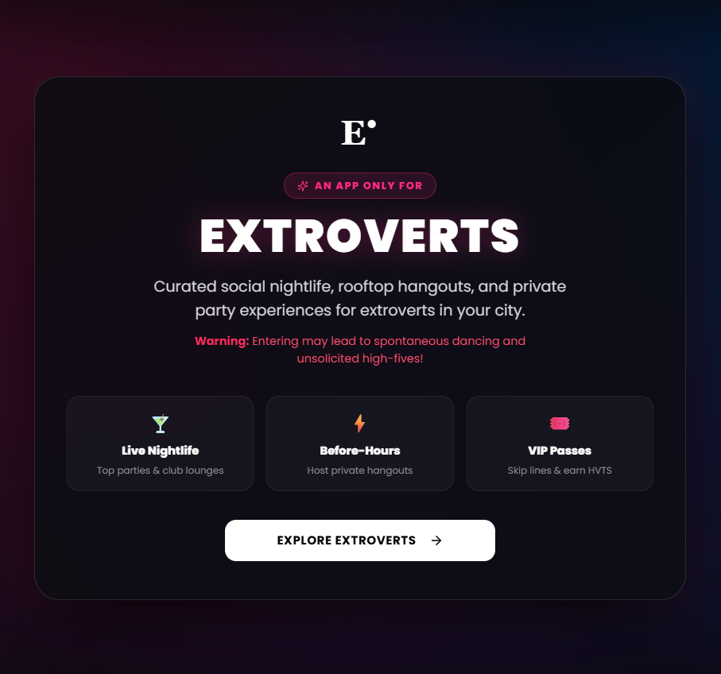
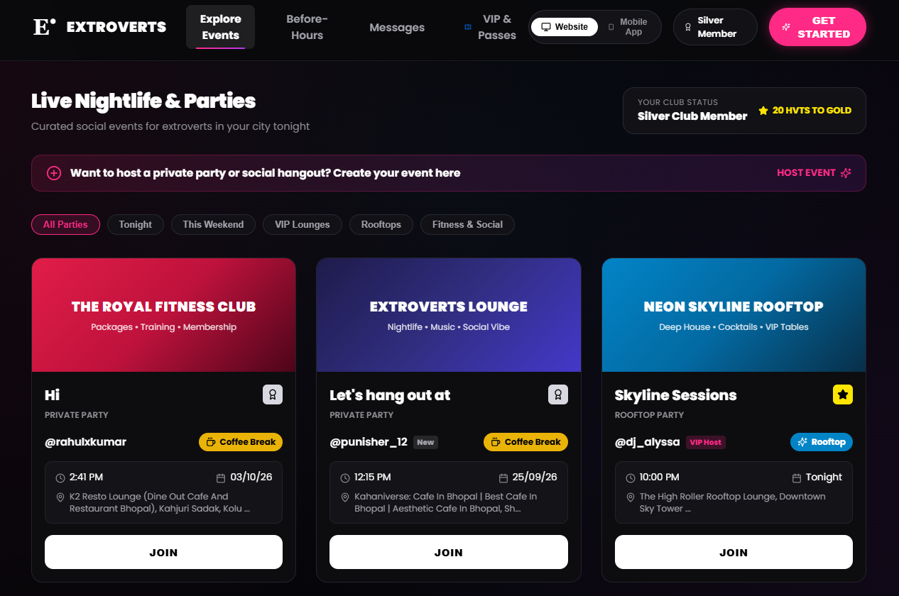
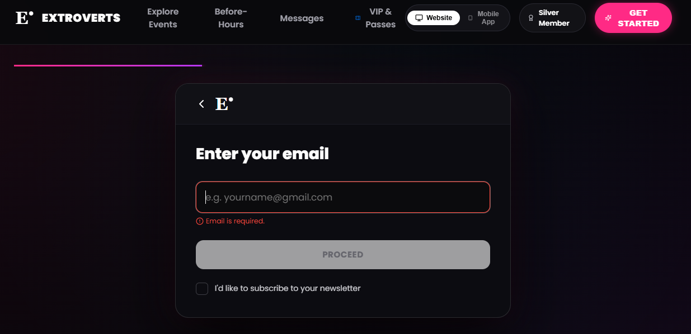
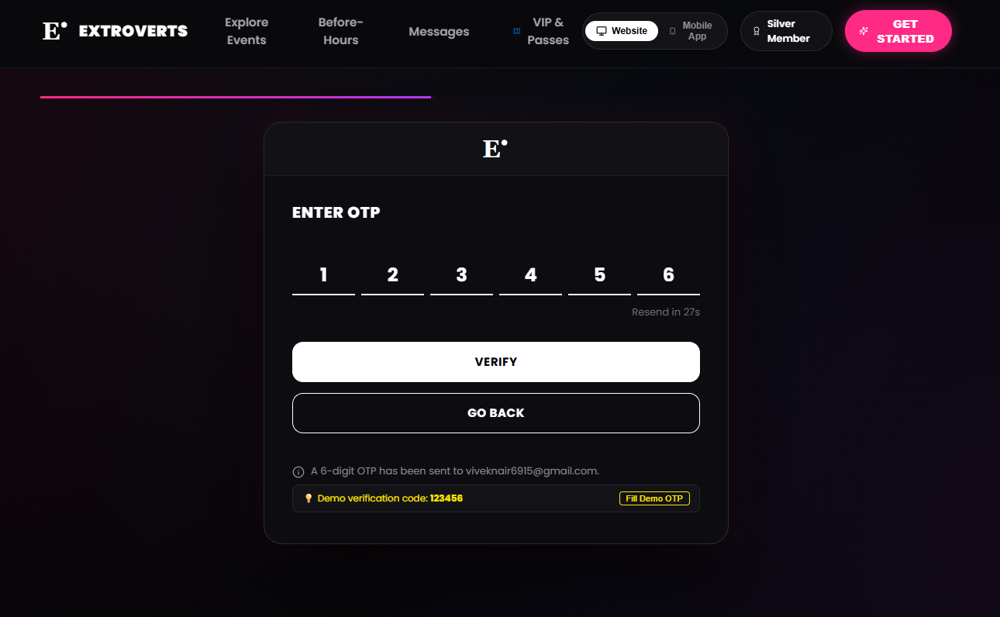
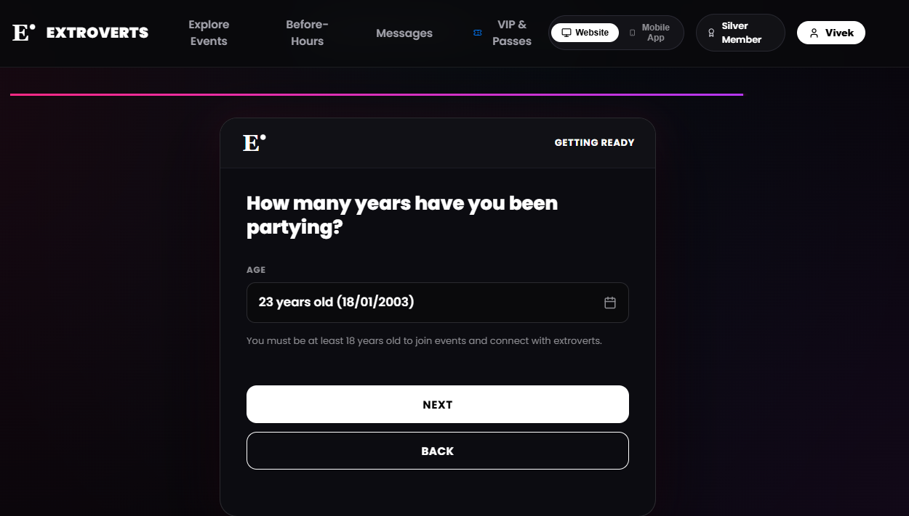
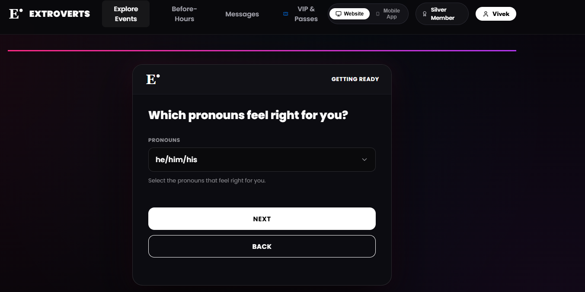
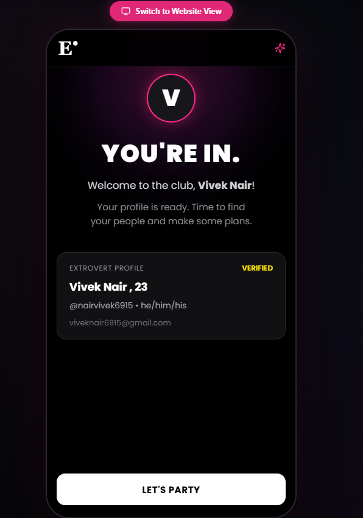
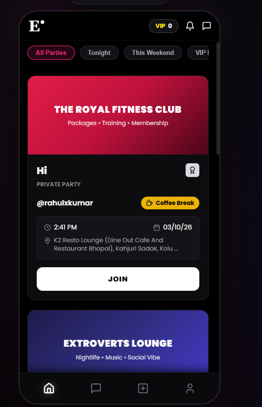

# NeonVibe

NeonVibe is a responsive frontend recreation of a modern social and event signup experience, developed as part of a frontend engineering assessment. It reproduces the authentic onboarding wizard and nightlife community interactions of the Extroverts platform with pixel-level attention to detail, robust client-side state management, and strict data validation.

---

## User Flow & Screenshots

| Step | Preview | Description |
| :---: | :--- | :--- |
| **1** |  | **Intro Splash Screen**<br>Ambient glow hero entrance highlighting curated nightlife, before-hours hangouts, and VIP passes. |
| **2** |  | **Events Discovery Feed (Desktop Website View)**<br>Full-width party feed with category filters (*All Parties, Tonight, VIP Lounges, Rooftops*), host cards, and RSVP buttons. |
| **3** |  | **Email Verification**<br>Accessible email field with RFC 5322 validation, error feedback, and newsletter opt-in toggle. |
| **4** |  | **6-Digit OTP Verification**<br>6-cell input with auto-advance, backspace jumping, paste support, 30s resend cooldown, and a one-click demo code helper. |
| **5** |  | **Age & Birthday Verification**<br>Calendar date selector with dynamic age calculation and strict 18+ validation. |
| **6** |  | **Pronoun Selection**<br>Modal selector with 14 pronoun options and a real-time maximum-3 limit guard. |
| **7** |  | **Celebratory Success Screen ("YOU'RE IN")**<br>Instant feedback card showing verified credentials and direct access to party features. |
| **8** |  | **Mobile Viewport Simulator**<br>Realistic mobile frame with responsive layout, status bar, and 4-tab bottom navigation (*Home, Chat, Create, Profile*). |

---

## Features

- **Mobile-First Responsive UI**: Adaptive layouts across mobile (375px-430px), tablet (768px-1024px), and desktop (1440px+).
- **Dual View Modes**: Switch between full desktop website view and an authentic 414px mobile app simulator.
- **Landing / Before-Hours Experience**: Recreates the Before-Hours screen with glowing neon typography, create CTA, and dashed After Party card.
- **Terms & Conditions Screen**: Brand terms highlighting community party guidelines and accept trigger.
- **Email Validation**: RFC 5322 regex validation with inline error feedback and optional newsletter subscription state.
- **OTP Verification Simulation**: Deterministic frontend verification flow with a dedicated demo code.
- **OTP Input Behavior**: 6 separate digit cells with automatic focus advance on digit entry, backspace navigation to previous inputs, and full clipboard paste support.
- **OTP Resend Flow**: 30-second cooldown timer preventing spam with visual countdown feedback.
- **Username Validation**: Strict 3–20 character limits, whitespace prohibition, and alphanumeric character enforcement.
- **Name Validation**: Real name verification ensuring 2–50 characters with alphabetic and standard name punctuation support.
- **Date of Birth Validation**: Calendar date check rejecting invalid calendar dates (e.g. February 30 or future years).
- **18+ Age Verification**: Real-time age calculation strictly requiring users to be 18 years or older before proceeding.
- **Pronoun Selection**: Accessible bottom-sheet selector containing 14 identity options with multi-select support.
- **Maximum 3 Pronouns Limit**: Real-time guard preventing selection of a fourth pronoun with inline feedback.
- **Multi-Step Wizard**: Sequential flow guiding users from initial signup through complete profile activation.
- **Back Navigation**: Bidirectional navigation enabling users to review and modify preceding inputs.
- **Form State Preservation**: Navigation back and forth retains all previously entered user input, backed by sessionStorage synchronization.
- **Loading & Error States**: Button spinner animations during simulated network requests and inline field errors.
- **Toast Notifications**: Non-blocking notification toasts for success, error, and informational feedback with automatic dismissal.
- **Success State**: Verified profile summary card confirming credentials before entering the community.
- **Accessibility Considerations**: ARIA attributes, semantic HTML elements, keyboard navigation, and high-contrast color pairings.

---

## Tech Stack

- **React 18** (`18.3.1`): Functional components, custom hooks, and Context API for global state.
- **TypeScript 5** (`5.6.3`): Strict type-checking (`strict: true`, `noUnusedLocals: true`).
- **Vite 5** (`5.4.10`): Fast modern build tool and development server with zero runtime overhead.
- **Vanilla CSS**: CSS Custom Properties design system, keyframe glow animations, glassmorphism backdrops, and media queries.
- **Lucide React** (`0.454.0`): Clean, accessible SVG iconography.
- **Google Fonts**: Modern typography pairing Poppins, Sacramento, Monoton, and Playfair Display.

---

## Getting Started

### Prerequisites
- Node.js (version 18 or higher recommended)
- npm (version 9 or higher)

### Installation
```bash
npm install
```

### Development Server
```bash
npm run dev
```

### Production Build
```bash
npm run build
```

### Preview Production Build
```bash
npm run preview
```

---

## Demo OTP

For evaluation and testing, the application uses a simulated frontend OTP code:

```
Demo OTP: 123456
```

- Clicking **"Fill Demo OTP"** automatically inputs `123456` into the 6 cells.
- Entering any other 6 digits triggers a simulated invalid OTP error.

---

## Validation Rules

| Field | Validation Rule | Error Feedback |
| :--- | :--- | :--- |
| **Email** | Valid RFC 5322 email structure (`user@domain.ext`) | *"Please enter a valid email address."* |
| **OTP** | Exactly 6 numeric digits matching `123456` | *"Invalid code. Please use demo code 123456"* |
| **Username** | 3–20 characters, no spaces, letters/numbers/underscores only | *"Username cannot contain spaces."* / *"Must be 3-20 chars."* |
| **Name** | 2–50 characters, letters, spaces, hyphens, apostrophes | *"Please enter a valid name with letters only."* |
| **Date of Birth** | Valid calendar date (1-31, 1-12, 1900-present) | *"Month must be between 01 and 12."* / *"Invalid date."* |
| **Age** | Real-time calculated age $\ge 18$ | *"You must be 18 or older to continue."* |
| **Pronouns** | 1 to 3 selections allowed | Blocked from selecting a 4th pronoun with counter notice |

---

## Project Structure

```
neonvibe/
├── public/
│   └── _redirects              # Single Page Application routing rules
├── Screenshots/
│   ├── image1.png              # Intro splash screen
│   ├── image2.png              # Events feed desktop view
│   ├── image3.png              # Email verification
│   ├── image4.png              # 6-digit OTP verification
│   ├── image5.png              # DOB & age verification
│   ├── image6.png              # Pronouns selector
│   ├── image7.png              # Success profile card
│   └── image8.png              # Mobile viewport simulator
├── src/
│   ├── components/             # Reusable UI components
│   │   ├── AccountPromptSheet.tsx
│   │   ├── AfterPartyCard.tsx
│   │   ├── BottomNavigation.tsx
│   │   ├── BottomSheet.tsx
│   │   ├── Button.tsx
│   │   ├── DatePickerSheet.tsx
│   │   ├── DesktopNavbar.tsx
│   │   ├── Input.tsx
│   │   ├── Logo.tsx
│   │   ├── OTPInput.tsx
│   │   ├── PassesModal.tsx
│   │   ├── PronounSelectorSheet.tsx
│   │   └── Toast.tsx
│   ├── context/
│   │   └── SignupContext.tsx   # Centralized wizard state & navigation
│   ├── data/
│   │   └── pronouns.ts         # Pronoun options list
│   ├── pages/                  # Page views
│   │   ├── ChatPage.tsx
│   │   ├── DateOfBirthPage.tsx
│   │   ├── EmailPage.tsx
│   │   ├── FeedEventsPage.tsx
│   │   ├── IntroSplashPage.tsx
│   │   ├── LandingPage.tsx
│   │   ├── NamePage.tsx
│   │   ├── OTPPage.tsx
│   │   ├── ProfileDashboardPage.tsx
│   │   ├── PronounsPage.tsx
│   │   ├── SuccessPage.tsx
│   │   ├── TermsPage.tsx
│   │   └── UsernamePage.tsx
│   ├── styles/
│   │   ├── animations.css      # Keyframe glow and transition animations
│   │   ├── global.css          # Core layouts, resets, and media queries
│   │   └── variables.css       # Color palette tokens and typography
│   ├── types/
│   │   └── index.ts            # TypeScript interfaces and types
│   ├── utils/
│   │   ├── age.ts              # Birthday calculation and calendar validation
│   │   └── validation.ts       # Field validators (email, username, name, OTP)
│   ├── App.tsx                 # Root router and view mode container
│   └── main.tsx                # React DOM root render
├── .env.example                # Example environment variable template
├── .gitignore                  # Production Git ignore rules
├── index.html                  # HTML entry point with font preconnects
├── package.json                # Project dependencies and npm scripts
├── tsconfig.json               # Strict TypeScript configuration
├── vercel.json                 # Vercel deployment configuration
└── vite.config.ts              # Vite configuration
```

---

## Design

The visual design is inspired by the reference application screenshots and embraces a high-energy nightlife aesthetic:
- **Color Palette**: Deep Obsidian Black (`#000000`, `#0a0a0c`), Neon Pink (`#ff2a85`), Neon Yellow/Amber (`#ffe600`), and Electric Purple (`#b537f2`).
- **Surface Elevation**: Glassmorphism translucent backdrops (`rgba(18, 18, 22, 0.85)` with `backdrop-filter: blur()`), subtle neon borders, and glow keyframes.
- **Typography**: Display typography using Google Fonts for a distinct social club identity.

---

## Assessment Notes

This project is a frontend-only implementation designed for client-side evaluation:
- No external backend or database is required to run the application.
- OTP dispatch, code verification, and registration persistence are simulated locally using client state and `sessionStorage`.
